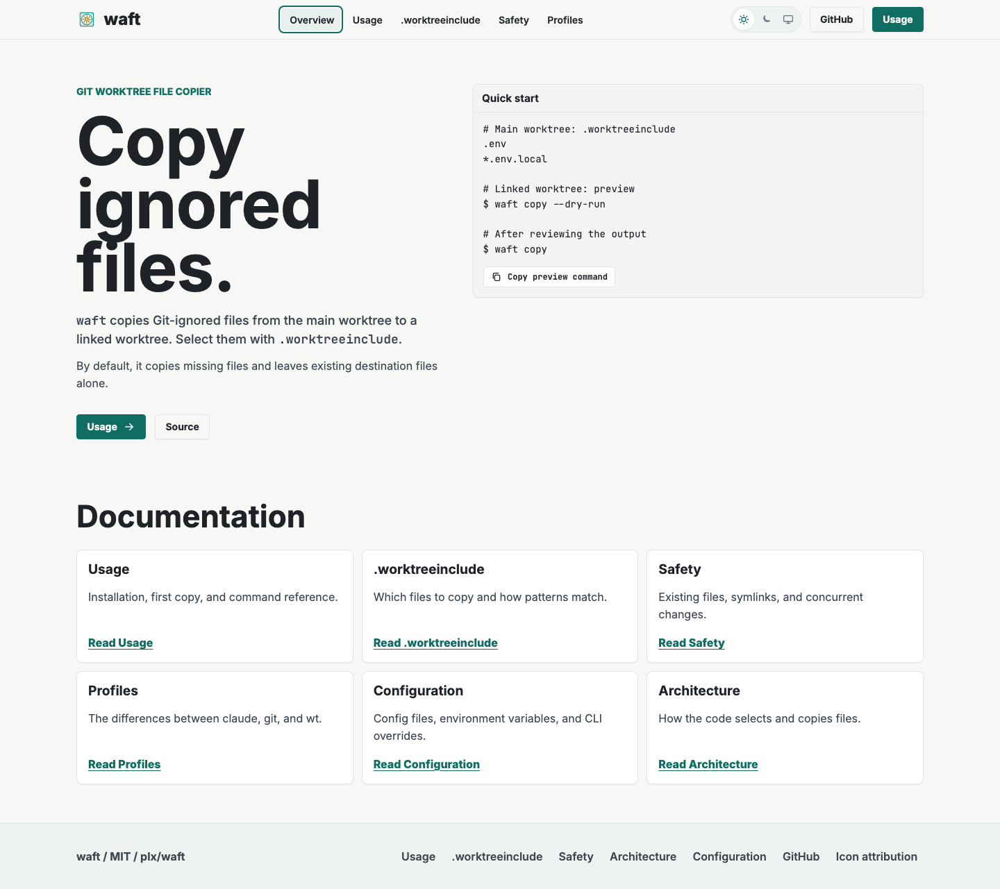
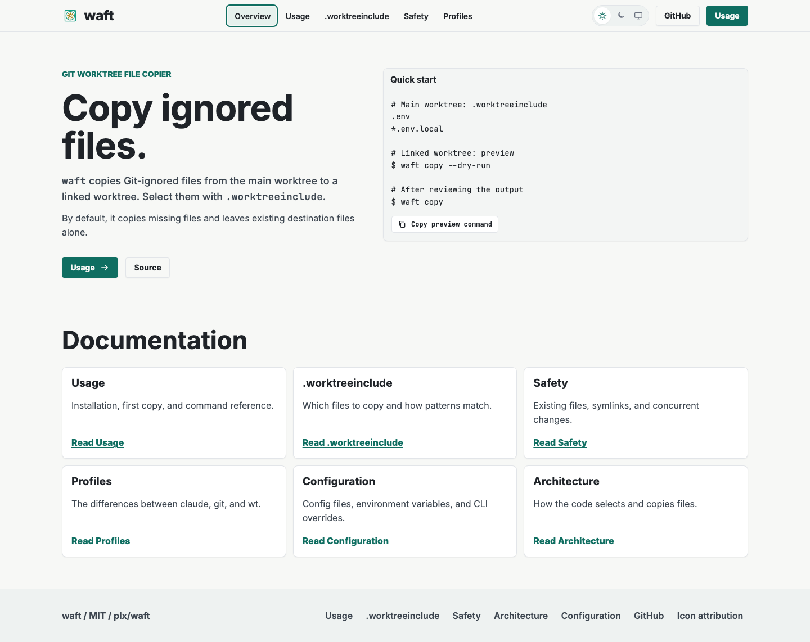
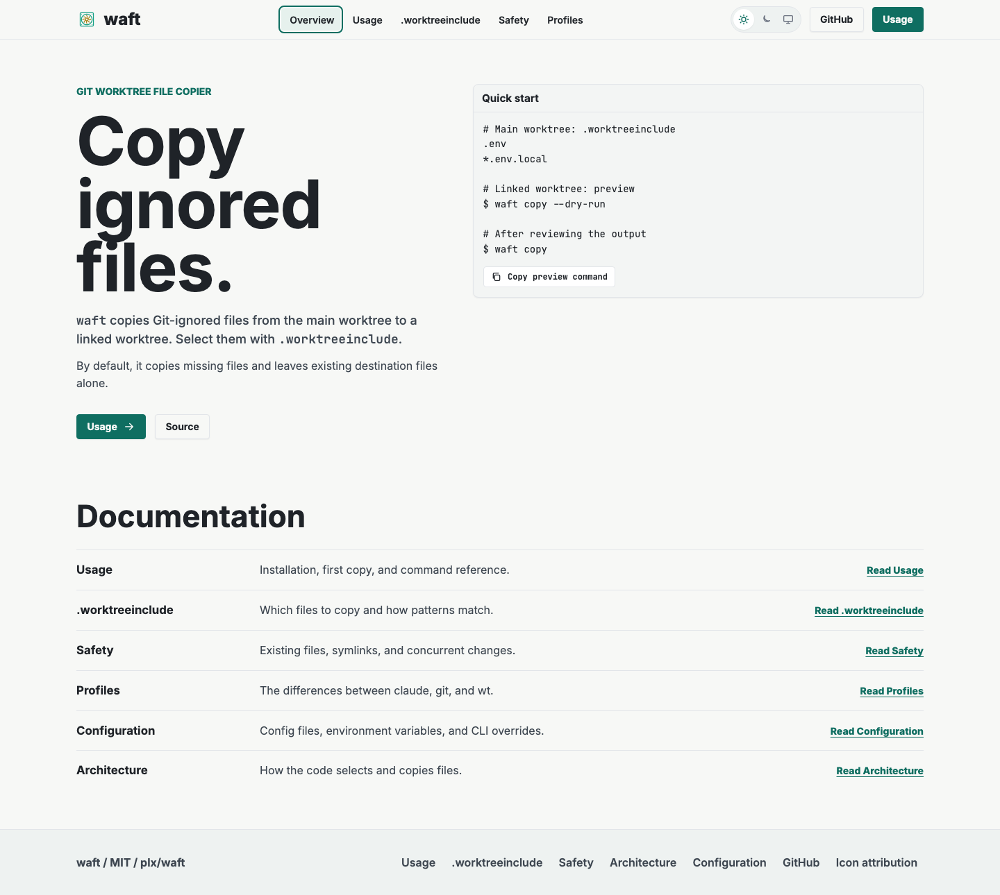

# Optional aesthetic changes

Open [index.html](index.html) in a browser for paired A/B captures with desktop,
mobile, light, and dark selectors. Each B changes one thing; A is the content
revision in this PR. Neither proposal is applied to production.

## 1. Smaller headline

Reduce the headline's desktop maximum from 96 to 64 px and its mobile minimum
from 48 to 40 px. This gives the explanation and docs more prominence without
changing the typeface or weight. It loses some of the original poster-like
character. This is the stronger recommendation.

| A: current styling | B: smaller headline |
| --- | --- |
|  |  |

Exact change: [proposal-headline.css](proposal-headline.css).

## 2. Documentation list

Use separated rows instead of six boxed cards. The titles form a scan line and
there is less framing around short descriptions. The current grid fits more
entries side by side on desktop; keeping it is also reasonable.

| A: current styling | B: documentation list |
| --- | --- |
|  |  |

Exact change: [proposal-index.css](proposal-index.css).

## Reproduce

From `site/`, install dependencies, build, and start the preview on a free port:

```sh
npm ci
npm run build
npm run preview -- --host 127.0.0.1 --port 4332
```

In another terminal, also from `site/`:

```sh
node design-system/preview/site-review/capture.mjs http://127.0.0.1:4332/waft/
```

The script applies each proposal only in its browser page, then saves captures
and dimensions to this directory. It does not modify the production source.
The captures use Chromium, loaded web fonts, a device scale of 1, and viewports
of 1440 by 1000 and 390 by 844. Both proposals preserve the canonical palette.
If a proposal is adopted, update the design-system contract and production CSS
in that later change.

Fan mark attribution: [../../ATTRIBUTION.md](../../ATTRIBUTION.md).
